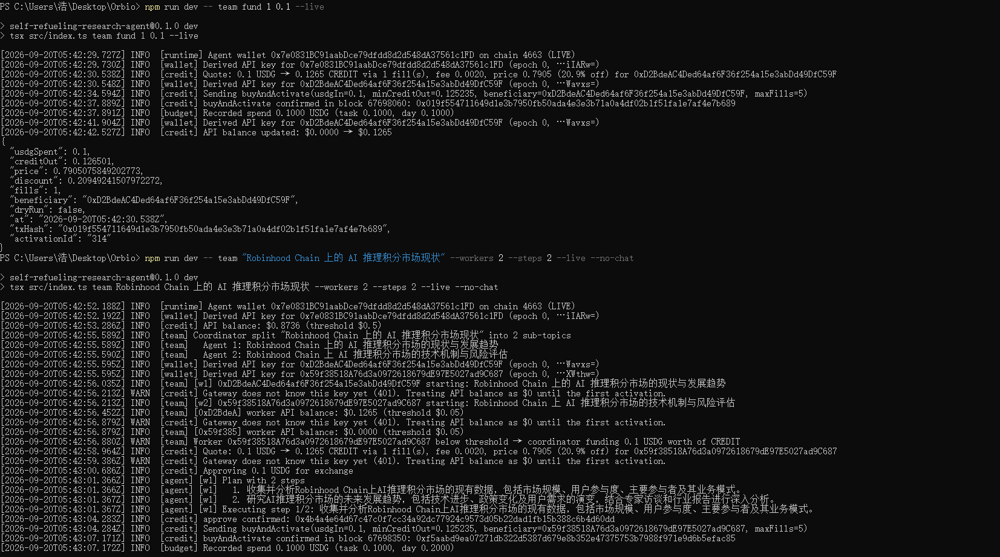
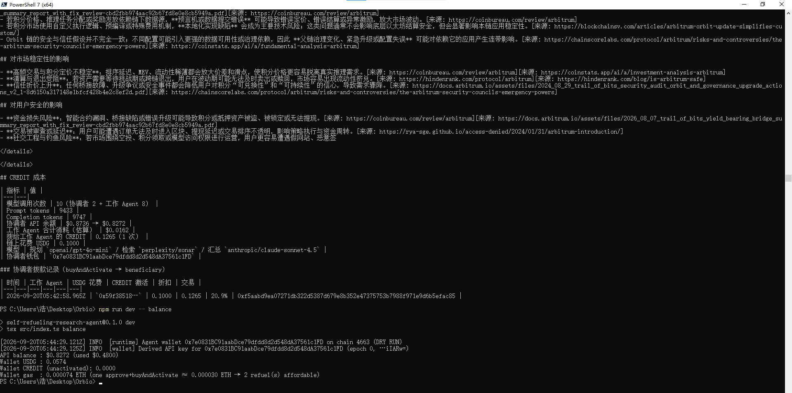

# Self-Refueling Research Agent — Orbio Build Competition Submission

*English first, 中文在后半部分。*

| | |
|---|---|
| **Repository** | https://github.com/ethvs/self-refueling-research-agent |
| **Chain** | Robinhood Chain mainnet (chain id 4663) |
| **Agent wallet** | `0x7e0831BC91aabDce79dfdd8d2d548dA37561c1FD` |
| **Stack** | TypeScript · Node 20+ · viem · OpenAI SDK pointed at the Orbio gateway · Express · zod |
| **Built** | 2026-09-19 → 2026-09-20, every feature verified on mainnet as it was added |
| **Screenshots** | [`docs/screenshots/`](docs/screenshots/) — index at the end of this file |

## The idea in one paragraph

*Inference is fuel.* Give the agent a research topic. It plans the work with a cheap model, runs web-grounded research steps that return real citations, and writes a Markdown report with a strong model — every call goes through the Orbio gateway. Between steps it reads its own Orbio API balance. When the balance drops below a threshold it quotes the on-chain Exchange order book and, if the discount is good enough and the budget allows, calls `buyAndActivate` to turn USDG into activated CREDIT for its own API key. No account, no card, no human in the loop. In team mode a coordinator agent does the same for gas-less worker agents by activating CREDIT straight into their wallets' API balances.

## How it uses Orbio

- **API key** is a wallet signature over `Orbio API key · chain 4663 · epoch N`, encoded as `sk-orb-N-base64(sig)`; rotation = bump the epoch. A fresh key gets `401` from the gateway until its first activation; the agent treats that as a `$0` balance and proceeds to buy.
- **Inference** via `https://api.orbio.so/api/v1` with the plain OpenAI SDK. Three-tier routing: plan with `openai/gpt-4o-mini`, research with `perplexity/sonar` (web search + citations), synthesize with `anthropic/claude-sonnet-4.5`; automatic fallback when a model has no provider.
- **Balance** via `GET /api/v1/key` (`balance.available`).
- **Refuel path**: `exchange.getQuote(usdgIn, maxFills)` → discount check (`price = (usdgSpent + fee) / creditOut`, buy only if `1 − price ≥ MIN_DISCOUNT`) → budget guard → gas and USDG pre-flight → `approve` (exact amount) → `buyAndActivate(usdgIn, minCreditOut, bytes32(beneficiary), maxFills)` → wait until the gateway balance reflects the activation.
- **Held CREDIT**: `credit.previewActivation` + `credit.activate(amount)` when the wallet already holds unactivated CREDIT.
- **Mid-run 402** ("insufficient balance") from the gateway → refuel immediately and retry the call once, instead of waiting for the next checkpoint.

## Features

- **CLI and single-page Web UI**: live log stream (SSE), report history, Markdown download, follow-up questions, side-by-side comparison of two reports, team mode selector.
- **Report archive**: `<id>.md` + `<id>.json` (raw step results, costs, follow-ups, status) + `<id>.log` (the full run log) per run. Runs that stop early still produce a report marked *partial* with the finished steps kept, so paid work is never lost.
- **Three budget layers**: on-chain USDG caps per task and per day (persisted), a gateway-spend cap per run, and a minimum discount. Start-up prints warnings when the caps contradict each other.
- **Error handling that was earned on mainnet**: gas and token pre-flight before any transaction, the Exchange's custom `InsufficientFunds()` revert decoded, deterministic chain errors never retried, planner JSON retried once, team synthesis falls back to concatenated sub-reports.
- **Team mode**: worker wallets are derived from the master key (`keccak256(key ‖ index)`), never stored, and hold **no gas and no USDG**. A worker below its threshold asks the coordinator, which funds it with `buyAndActivate(..., beneficiary = worker)` under the coordinator's discount rule and budget guard, serialized so parallel workers never race the coordinator's nonce. One failing worker does not stop the others.
- **Tests**: 11 unit tests over the pure logic (key derivation, discount rule, budget guard, config warnings, 402 detection and refuel, partial reports, planner retry).
- **Reusable credit layer**: seven files with no dependency on the research code; the README section *How to add self-refueling to your own agent* shows the whole integration in about twenty lines.

## Mainnet evidence

Everything below happened on Robinhood Chain mainnet. Transaction hashes can be checked on a Robinhood Chain block explorer or directly through the public RPC (`https://rpc.mainnet.chain.robinhood.com`). The whole project cost about **1.2 USDG on-chain** and about **$0.55 of gateway usage**.

| Date (UTC) | Action | Result and proof |
|---|---|---|
| 2026-09-19 | **First self-refuel** from a `$0` API balance: 1 USDG → 1.3072 CREDIT, 1 fill, fee 0.0196, discount 23.5% | approve `0xee961563a3af01060f278cb21fbd533cd2a02d186817b1cd6af5b58078123515` · buyAndActivate `0xef4d783b4c3bb2142c779bd609facdd33ad991e6a8d704ff72162537893c4e65` (block 67212210, activationId 250) · gateway balance `$0.0000 → $1.3072` |
| 2026-09-19 | **Real research run**, 3 steps + synthesis (5 gateway calls, 12,294 tokens) | `$0.0702` spent (`$1.2703 → $1.2001`), sources are real URLs — [`reports/2026-09-19T17-12-45_…md`](reports/) and the 18:32 run next to it |
| 2026-09-19 | **Follow-up question** on a finished report | Model answered honestly that the report did not cover the question and proposed extra steps instead of inventing data |
| 2026-09-19 | **Compare** two runs on the same topic (17:12 vs 18:32) | 5 shared conclusions, 4 wording differences, an 11-metric data-change table, flagged an inconsistent DEX-volume definition; ≈ `$0.03` — [`reports/compare_2026-09-19T18-46-19.md`](reports/compare_2026-09-19T18-46-19.md) |
| 2026-09-19 | **Web UI** real run "现在加密货币是牛市了吗" | 61 s, `$0.0563`, live SSE log, compare from the browser — [`reports/2026-09-19T18-48-23_…md`](reports/) |
| 2026-09-20 | **Team mode, DRY RUN** (workers share the coordinator key): 3 sub-topics, 3 workers × 2 steps in parallel | 87 s, 14 calls, `$0.0712` — [`reports/2026-09-20T04-24-43_…md`](reports/) |
| 2026-09-20 | **On-chain funding of a worker**: `team fund 1 0.1 --live`, 0.1 USDG → 0.1265 CREDIT (20.9% discount) activated to worker 1 `0xD2BdeAC4Ded64af6F36f254a15e3abDd49DfC59F` | buyAndActivate `0x019f554711649d1e3b7950fb50ada4e3e3b71a0a4df02b1f51fa1e7af4e7b689` (block 67698060, activationId 314) · worker 1 gateway balance `$0.0000 → $0.1265` · the worker wallet never held gas or USDG. The first attempt reverted with `InsufficientFunds()` because the coordinator wallet had 0 USDG (approve `0xbe764a3dfd5a7f450d117eb2928385ece5d2e78abaee650c5b7bfb65426eb101` is on-chain); that failure is why the pre-flight balance check exists |
| 2026-09-20 | **Team run, live**: `team "…" --workers 2 --steps 2 --live`; worker 2 `0x59f38518A76d3a0972618679dE97E5027ad9C687` started at `$0` and was funded automatically by the coordinator | approve `0x4b4a4e64d67c47c0f7cc34a92dc77924c9573d05b22dad1fb15b388c6b4d60dd` · buyAndActivate `0xf5aabd9ea07271db322d5387d679e8b352e47375753b7988f971e9d6b5efac85` (block 67698350) · worker 2 `$0.0000 → $0.1265` · 10 calls, 88 s, 0.1 USDG on-chain, ≈ `$0.06` gateway — [`reports/2026-09-20T05-44-21_…md`](reports/) |
| 2026-09-20 | **Checkpoint accounting + log archive**: 3-step run with the per-run gateway cap | checkpoints logged `API spend this run: $0.0070 / cap $0.5` then `$0.0110 / cap $0.5`; 56 s, 5 calls, `$0.0588`; the report says "no public data found" where that was true — [`reports/2026-09-20T07-27-37_…`](reports/) `.md` / `.json` / `.log` |

Contracts used (official deployments): Exchange `0x6951ffd32630b05e06f50062aea801625a58ebc0`, CREDIT `0xe33322da1380e61e5ae5dfb21e7f62924c73004c`, USDG `0x5fc5360d0400a0fd4f2af552add042d716f1d168`. Measured gas: approve 57,964, buyAndActivate 174,876 at ≈ 0.065 gwei, so one refuel costs ≈ 0.000016 ETH.





Quick check of the worker-funding transaction from any machine:

```bash
curl -s https://rpc.mainnet.chain.robinhood.com -H "content-type: application/json" -d '{"jsonrpc":"2.0","id":1,"method":"eth_getTransactionReceipt","params":["0x019f554711649d1e3b7950fb50ada4e3e3b71a0a4df02b1f51fa1e7af4e7b689"]}'
```

## Try it in 60 seconds

Offline, no key, no network, no money:

```bash
npm install
npm run demo        # plan → steps → balance drops → quote → buyAndActivate (simulated) → report in reports/
npm run demo:team   # coordinator funds 3 workers, parallel research, merged team report
npm run web:mock    # the same in the browser at http://localhost:3000
npm test
```

Real mode: copy `.env.example` to `.env`, set `PRIVATE_KEY` (the wallet needs a little ETH for gas and some USDG). `DRY_RUN=true` (default) quotes but never sends a transaction; add `--live` to transact.

```bash
npm run dev -- balance
npm run dev -- quote 1
npm run dev -- "your topic" --steps 3
npm run dev -- team "your topic" --workers 2 --live
npm run web
```

## What is real and what is simulated

- **Real**: everything in the evidence table, and every file under `reports/` dated 2026-09-19 / 2026-09-20 (real citations, real balances, real transaction hashes).
- **Mock** (`--mock`, the `demo*` scripts): in-memory balance, a fixed 18%-discount order book, canned model output. Easy to spot: the first log line says `(MOCK)`, transaction hashes start with `0xmock`, sources read "示例机构报告 2026".
- **DRY RUN** (default in real mode): real gateway and real quotes, but no transaction is sent; in team mode the workers share the coordinator's key. The first log line says `(DRY RUN)`; live runs say `(LIVE)`.

## Deliberately out of scope

Telegram/Discord bot, automatic `sell` orders for surplus CREDIT, and a Uniswap fallback route were considered and left out. `team transfer` (`credit.transfer` to a worker) is implemented but has not been exercised on mainnet.

## Safety

The private key lives only in the git-ignored `.env`; API keys are derived in memory and never written to disk; the test wallet holds only dust. Default budgets in `.env.example` are conservative, and every purchase approves exactly the amount it spends.

## Screenshot index (`docs/screenshots/`)

All CLI screenshots are from the author's PowerShell terminal; the first log line of each run shows `(LIVE)`, `(DRY RUN)` or `(MOCK)`.

| File | Shows | Mode |
|---|---|---|
| `01-cli-research-run.png` | A real research run: 3-step plan, balance checked at each checkpoint, report saved, summary `5 calls, $1.2001 → $1.1318` | real gateway, DRY RUN chain |
| `02-report-cost-and-followup.png` | The report's cost table and refuel-record table, then the interactive follow-up where the model says the report did not cover the question | real |
| `03-cli-compare.png` | `compare` of two reports: shared conclusions and differences | real |
| `04-web-ui-report.png` | Web UI: history sidebar with per-report cost, rendered report, download link | real gateway, DRY RUN chain |
| `05-web-ui-compare.png` | Web UI: comparison tab for two selected reports | real gateway, DRY RUN chain |
| `06-team-demo-mock.png` | `npm run demo:team`: coordinator splits the topic, three workers start at `$0`, each is funded via `buyAndActivate(beneficiary = worker)`, budget guard records each spend | **MOCK** |
| `07-mainnet-worker-funding.png` | `team fund 1 0.1 --live` confirmed in block 67698060 (activationId 314, worker balance `$0 → $0.1265`), then the live team run where worker 2 is funded automatically (approve + buyAndActivate in block 67698350) | **LIVE mainnet** |
| `08-mainnet-team-report.png` | The live team report: real sources, conclusions, team table (worker 2 `$0.0000 → $0.1183`, 1 funding) | LIVE mainnet |
| `09-mainnet-team-cost-and-balance.png` | Cost table of the live team run, coordinator funding record with the transaction hash, and `balance` showing wallet USDG / gas and how many refuels the gas still affords | LIVE mainnet |
| `10-checkpoint-api-spend.png` | Checkpoints logging `API spend this run: $0.0070 / cap $0.5` → `$0.0110 / cap $0.5`, summary `5 calls, $0.8272 → $0.7684` | real gateway, DRY RUN chain |
| `11-typecheck-test-build.png` | `npm run typecheck`, `npm test` (11 passing), `npm run build` | — |
| `12-preflight-insufficient-funds.png` | The reverted `buyAndActivate` (`InsufficientFunds()`, selector `0x356680b7`) when the wallet had 0 USDG, next to `balance` showing `Wallet USDG : 0.0000` — the failure that led to the pre-flight checks (the table at the top of the image is the tail of the preceding offline demo; its hashes start with `0xmock`) | LIVE mainnet |

---

# 参赛提交说明（中文）

| | |
|---|---|
| **仓库** | https://github.com/ethvs/self-refueling-research-agent |
| **链** | Robinhood Chain 主网（chain id 4663） |
| **Agent 钱包** | `0x7e0831BC91aabDce79dfdd8d2d548dA37561c1FD` |
| **技术栈** | TypeScript · Node 20+ · viem · OpenAI SDK（指向 Orbio 网关）· Express · zod |
| **开发周期** | 2026-09-19 → 2026-09-20，每个功能做完即在主网验证 |
| **截图** | [`docs/screenshots/`](docs/screenshots/)，索引见本节末尾 |

## 一句话

**推理即燃料。** 输入一个研究主题，Agent 用便宜模型规划、用联网检索模型逐步研究（带真实引用）、用强模型写成 Markdown 报告，全部调用走 Orbio 网关。每两步读一次自己的 Orbio API 余额，低于阈值就向链上 Exchange 订单簿询价，折扣达标且预算允许时调用 `buyAndActivate`，把 USDG 换成已激活的 CREDIT 直接充进自己的 API Key。不注册账号、不绑卡、全程无人干预。团队模式下，协调者用同样的方式给不持有 gas 和 USDG 的工作 Agent 按需激活额度。

## 与 Orbio 的集成

- **API Key**：钱包对 `Orbio API key · chain 4663 · epoch N` 签名，编码为 `sk-orb-N-base64(sig)`；轮换 = epoch+1。新 Key 首次激活前网关返回 401，按余额 $0 处理并直接进入购买流程。
- **推理**：`https://api.orbio.so/api/v1`，OpenAI SDK 直连。三层模型路由：规划 `openai/gpt-4o-mini` → 检索 `perplexity/sonar`（联网 + 引用）→ 总结 `anthropic/claude-sonnet-4.5`，模型无提供方时自动回退。
- **余额**：`GET /api/v1/key` 的 `balance.available`。
- **续费链路**：`exchange.getQuote` → 折扣计算（`price = (usdgSpent + fee) / creditOut`，`1 − price ≥ MIN_DISCOUNT` 才买）→ 预算守卫 → gas / USDG 预检 → 精确额度 `approve` → `buyAndActivate(usdgIn, minCreditOut, bytes32(beneficiary), maxFills)` → 等网关余额更新。
- **已持有 CREDIT**：`credit.previewActivation` + `credit.activate(amount)`。
- **中途 402**：网关在两次检查点之间报余额耗尽时，立即续费并重试一次。

## 功能

- **CLI + 单页 Web 界面**：SSE 实时日志、历史报告、下载 Markdown、追问、勾选两份报告对比、团队模式选择。
- **报告归档**：每次运行生成 `<id>.md` + `<id>.json`（步骤原始结果、成本、追问、状态）+ `<id>.log`（完整日志）。中途失败也归档，报告顶部标注「未完成」和原因，已付费的步骤不丢。
- **三层预算**：链上 USDG 单任务 / 每日上限（持久化）、每次运行的网关花费上限、最低折扣；启动时检查配置是否自洽并打印警告。
- **在主网上踩出来的错误处理**：发交易前预检 gas 和代币余额，解码 Exchange 的 `InsufficientFunds()` 自定义错误，确定性链上错误不重试，规划 JSON 不合法重试一次，团队汇总失败降级为拼接子报告。
- **团队模式**：工作钱包由主私钥派生（`keccak256(主私钥 ‖ 序号)`），不落盘，**不持有 gas 和 USDG**。工作 Agent 余额低于阈值时向协调者申请，协调者按自己的折扣策略和预算守卫用 `buyAndActivate(..., beneficiary = worker)` 拨款，拨款串行执行避免 nonce 冲突。单个 Agent 失败不影响其他 Agent。
- **测试**：11 个纯逻辑单元测试（Key 派生、折扣规则、预算守卫、配置检查、402 识别与续费、部分报告、规划重试）。
- **可复用的额度层**：七个文件，不依赖研究逻辑；README 的「How to add self-refueling to your own agent」一节用二十来行代码展示完整接入。

## 主网验证记录

以下全部发生在 Robinhood Chain 主网，交易哈希可在区块浏览器或公共 RPC（`https://rpc.mainnet.chain.robinhood.com`）核对。整个项目链上共花约 **1.2 USDG**，网关消耗约 **$0.55**。

| 日期（UTC） | 操作 | 结果与证据 |
|---|---|---|
| 2026-09-19 | **首次自动续费**，API 余额从 $0 开始：1 USDG → 1.3072 CREDIT，1 笔成交，手续费 0.0196，折扣 23.5% | approve `0xee961563a3af01060f278cb21fbd533cd2a02d186817b1cd6af5b58078123515` · buyAndActivate `0xef4d783b4c3bb2142c779bd609facdd33ad991e6a8d704ff72162537893c4e65`（block 67212210，activationId 250）· 网关余额 `$0.0000 → $1.3072` |
| 2026-09-19 | **真实研究运行**，3 步 + 总结（5 次调用，12,294 tokens） | 花费 `$0.0702`（`$1.2703 → $1.2001`），来源为真实网址，见 `reports/2026-09-19T17-12-45_…md` 及旁边 18:32 的一份 |
| 2026-09-19 | **追问** | 模型如实回答「报告未涉及」并给出可追加的研究步骤，未编造 |
| 2026-09-19 | **对比**同一主题 17:12 与 18:32 两份报告 | 5 条共同结论、4 处表述差异、11 项指标的数据变化表，并指出 DEX 交易量口径不一致；约 `$0.03`，见 `reports/compare_2026-09-19T18-46-19.md` |
| 2026-09-19 | **Web 界面**真实运行「现在加密货币是牛市了吗」 | 61 秒，`$0.0563`，SSE 实时日志，网页端对比正常，见 `reports/2026-09-19T18-48-23_…md` |
| 2026-09-20 | **团队模式 DRY RUN**（工作 Agent 共用协调者 Key）：拆 3 个子课题，3 个 Agent 并行各 2 步 | 87 秒，14 次调用，`$0.0712`，见 `reports/2026-09-20T04-24-43_…md` |
| 2026-09-20 | **链上给工作 Agent 拨款**：`team fund 1 0.1 --live`，0.1 USDG → 0.1265 CREDIT（折扣 20.9%）激活到 1 号 Agent 钱包 `0xD2BdeAC4Ded64af6F36f254a15e3abDd49DfC59F` | buyAndActivate `0x019f554711649d1e3b7950fb50ada4e3e3b71a0a4df02b1f51fa1e7af4e7b689`（block 67698060，activationId 314）· 1 号 Agent 网关余额 `$0.0000 → $0.1265` · 工作钱包全程没有 gas 和 USDG。首次尝试因协调者钱包 USDG 为 0 回滚 `InsufficientFunds()`（approve `0xbe764a3dfd5a7f450d117eb2928385ece5d2e78abaee650c5b7bfb65426eb101` 已上链），由此加入了发交易前的余额预检 |
| 2026-09-20 | **团队模式真实链上运行**：`team "…" --workers 2 --steps 2 --live`，2 号 Agent `0x59f38518A76d3a0972618679dE97E5027ad9C687` 余额 $0，协调者自动拨款 | approve `0x4b4a4e64d67c47c0f7cc34a92dc77924c9573d05b22dad1fb15b388c6b4d60dd` · buyAndActivate `0xf5aabd9ea07271db322d5387d679e8b352e47375753b7988f971e9d6b5efac85`（block 67698350）· 2 号余额 `$0.0000 → $0.1265` · 10 次调用、88 秒、链上 0.1 USDG、网关约 `$0.06`，见 `reports/2026-09-20T05-44-21_…md` |
| 2026-09-20 | **检查点记账 + 日志归档**：3 步运行，带每次运行的网关花费上限 | 检查点日志 `API spend this run: $0.0070 / cap $0.5` → `$0.0110 / cap $0.5`；56 秒，5 次调用，`$0.0588`；查不到的数据如实写「未找到公开资料」，见 `reports/2026-09-20T07-27-37_…` 的 `.md` / `.json` / `.log` |

使用的合约（官方部署）：Exchange `0x6951ffd32630b05e06f50062aea801625a58ebc0`，CREDIT `0xe33322da1380e61e5ae5dfb21e7f62924c73004c`，USDG `0x5fc5360d0400a0fd4f2af552add042d716f1d168`。实测 gas：approve 57,964，buyAndActivate 174,876，约 0.065 gwei，一次续费约 0.000016 ETH。


## 60 秒上手

离线演示，不需要私钥、不联网、不花钱：

```bash
npm install
npm run demo        # 规划 → 执行 → 余额下降 → 报价 → buyAndActivate（模拟）→ 报告写入 reports/
npm run demo:team   # 协调者给 3 个工作 Agent 拨款，并行研究，汇总团队报告
npm run web:mock    # 浏览器里跑同样的流程，http://localhost:3000
npm test
```

真实模式：复制 `.env.example` 为 `.env`，填写 `PRIVATE_KEY`（钱包需要少量 ETH 作 gas 和一些 USDG）。默认 `DRY_RUN=true` 只报价不发交易，加 `--live` 才真实交易。

## 哪些是真实的，哪些是模拟的

- **真实**：验证记录表中的全部条目，以及 `reports/` 下 2026-09-19 / 09-20 的所有文件（真实引用、真实余额、真实交易哈希）。
- **模拟**（`--mock`，`demo*` 脚本）：内存假余额、固定 18% 折扣的假订单簿、固定模型回复。识别方法：首行日志标 `(MOCK)`，交易哈希以 `0xmock` 开头，来源写「示例机构报告 2026」。
- **DRY RUN**（真实模式默认）：真实网关、真实报价，但不发交易；团队模式下工作 Agent 共用协调者 Key。首行日志标 `(DRY RUN)`，真实交易运行标 `(LIVE)`。

## 明确不在范围内

Telegram / Discord Bot、多余 CREDIT 自动挂单卖出、Uniswap 备选买入路径，经考虑后不做。`team transfer`（`credit.transfer` 给工作 Agent）已实现但未在主网实测。

## 安全

私钥只存在被 git 忽略的 `.env` 里；API Key 在内存中派生，不写盘；测试钱包只放少量资金。`.env.example` 的默认预算保守，每次购买只授权本次花费的精确额度。

## 截图索引（`docs/screenshots/`）

CLI 截图均来自作者的 PowerShell 终端，每次运行的首行日志标明 `(LIVE)`、`(DRY RUN)` 或 `(MOCK)`。

| 文件 | 内容 | 模式 |
|---|---|---|
| `01-cli-research-run.png` | 真实研究运行：3 步计划、每个检查点读余额、报告保存、汇总 `5 calls, $1.2001 → $1.1318` | 真实网关，链上 DRY RUN |
| `02-report-cost-and-followup.png` | 报告的成本表和续费记录表，然后是交互式追问，模型如实回答「报告未涉及」 | 真实 |
| `03-cli-compare.png` | `compare` 两份报告：共同结论与差异 | 真实 |
| `04-web-ui-report.png` | Web 界面：带成本的历史列表、报告渲染、下载链接 | 真实网关，链上 DRY RUN |
| `05-web-ui-compare.png` | Web 界面：两份报告的对比结果页 | 真实网关，链上 DRY RUN |
| `06-team-demo-mock.png` | `npm run demo:team`：协调者拆题，3 个工作 Agent 从 $0 开始，各自通过 `buyAndActivate(beneficiary = worker)` 获得拨款，预算守卫逐笔记账 | **模拟** |
| `07-mainnet-worker-funding.png` | `team fund 1 0.1 --live` 在 block 67698060 确认（activationId 314，工作 Agent 余额 `$0 → $0.1265`），随后真实团队运行中 2 号 Agent 被自动拨款（approve + buyAndActivate，block 67698350） | **主网真实交易** |
| `08-mainnet-team-report.png` | 真实团队报告：真实来源、结论、团队分工表（2 号 `$0.0000 → $0.1183`，拨款 1 次） | 主网真实交易 |
| `09-mainnet-team-cost-and-balance.png` | 真实团队运行的成本表、含交易哈希的协调者拨款记录，以及 `balance` 显示的钱包 USDG / gas 和还够几次续费 | 主网真实交易 |
| `10-checkpoint-api-spend.png` | 检查点日志 `API spend this run: $0.0070 / cap $0.5` → `$0.0110 / cap $0.5`，汇总 `5 calls, $0.8272 → $0.7684` | 真实网关，链上 DRY RUN |
| `11-typecheck-test-build.png` | `npm run typecheck`、`npm test`（11 个通过）、`npm run build` | — |
| `12-preflight-insufficient-funds.png` | 钱包 USDG 为 0 时 `buyAndActivate` 回滚 `InsufficientFunds()`（选择器 `0x356680b7`），旁边 `balance` 显示 `Wallet USDG : 0.0000`，正是这次失败催生了发交易前的预检（图片顶部的表格是前一次离线演示的结尾，哈希以 `0xmock` 开头） | 主网真实交易 |
